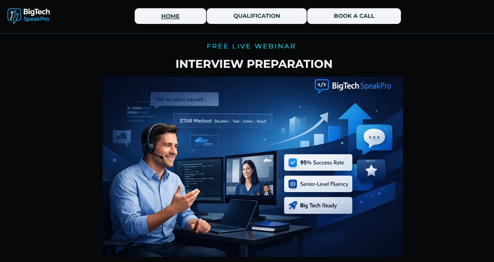

# ActiveCampaign-marketing-automation-system

## 📋 Overview
This project demonstrates a **marketing automation system built in ActiveCampaign** for a webinar funnel targeting **IT specialists preparing for job interviews in US companies**.

The system automates the full lead journey — from **lead capture and qualification to webinar participation and post-webinar sales follow-up**.

The automation includes:
- Lead capture through a **Wix landing page**
- Lead qualification using **Typeform**
- Automatic addition of leads to an **ActiveCampaign CRM pipeline**
- **Automated email sequences** for confirmations, reminders, and webinar access
- Integration workflows built with **Make (Integromat)**
- Post-webinar follow-up emails guiding leads to book a **strategy call via Calendly**

---

## 🖼 Sales Pipeline

---

## 🛠 Automation Setup Steps

1. **Lead Capture & Qualification**
   - Leads register via a **Wix landing page**
   - Qualification questions are completed through **Typeform**
   - Qualified leads are automatically added to **ActiveCampaign CRM**
     
   

2. **CRM Pipeline Management**
   - Leads are placed into a **sales pipeline**
   - Status updates track progress through the funnel
   - Lead data is structured for sales follow-up and analysis

3. **Email Automation**
   - Automated email sequences send:
     - registration confirmations
     - webinar reminders
     - webinar access links
   - Emails are triggered by CRM events and lead status changes

4. **Calendar Integration**
   - Using **Make (Integromat)**, webinar events are automatically added to **Google Calendar**
   - This ensures participants receive calendar reminders and easy access to the event

5. **Post-Webinar Follow-up**
   - After the webinar, automated emails guide participants to:
     - book a **strategy call via Calendly**
     - continue engagement through the sales funnel

---

## ✅ Outcomes

1. **Automated Lead Management**
   - Leads move automatically from registration to CRM pipeline without manual input.

2. **Improved Webinar Attendance**
   - Reminder sequences and calendar integration help increase participation.

3. **Streamlined Sales Funnel**
   - Qualified leads progress from webinar attendance to **strategy call booking**.

4. **Reduced Manual Work**
   - Integrations between tools automate repetitive marketing and CRM tasks.

5. **Centralized Lead Data**
   - All lead activity is tracked within **ActiveCampaign CRM**, enabling better visibility of the funnel.

---

## 🧰 Tools Used
- **ActiveCampaign** — CRM management and email automation  
- **Wix** — landing page for webinar registration  
- **Typeform** — lead qualification form  
- **Make (Integromat)** — automation and integrations  
- **Google Calendar** — automated webinar event scheduling  
- **Calendly** — strategy call booking system  

---
